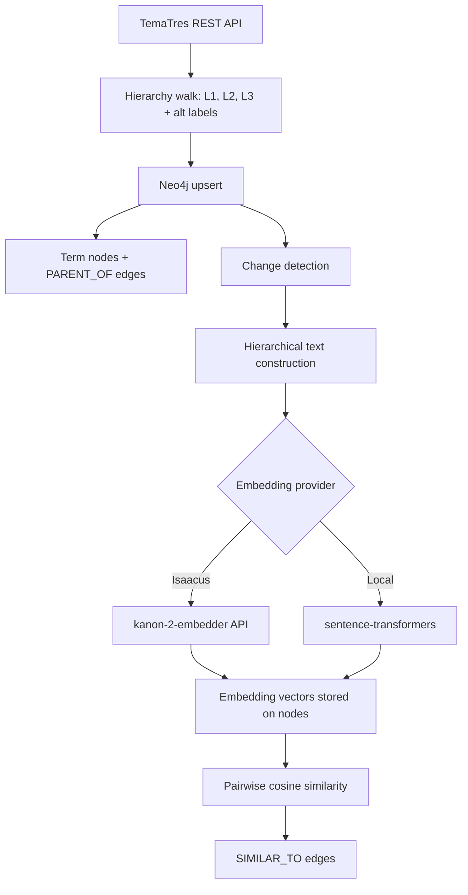

# Technical Methodology: AGIFT Graph Builder

## About

This is the technical methodology for the [AGIFT Graph Builder](https://deepcivic.com.au/resources/agift-graph-builder). It accompanies the project README and source repository.

DeepCivic uses the AGIFT Graph Builder to categorise incomplete metadata from open Australian government datasets and map them to DCAT-AP, the metadata standard used by open data portals in Europe and internationally. The graph enables semantic matching between dataset descriptions and the Australian Government Interactive Functions Thesaurus (AGIFT), a controlled vocabulary of government business functions maintained by the National Archives of Australia.

AGIFT is a living vocabulary — the National Archives add, rename, and restructure terms over time. The pipeline runs on a weekly schedule to keep the graph current.

## Pipeline steps

### 1. Vocabulary fetch

The pipeline walks the TemaTres REST API to retrieve the full AGIFT hierarchy across three levels: top-level functions (L1), secondary functions (L2), and detailed functions (L3). Alternative labels for each term are fetched concurrently in a separate pass using a thread pool.

API endpoint: `https://vocabularyserver.com/agift/services.php`

| API task | Purpose | Example |
|----------|---------|---------|
| `fetchTopTerms` | Retrieve L1 functions | "Business support and regulation" |
| `fetchDown` | Walk children of a term | L1 to L2, L2 to L3 |
| `fetchAlt` | Get alternative labels | "hydrology monitoring" |

Input: TemaTres REST API | Output: AGIFT term records with hierarchy and alternative labels

### 2. Graph construction

Terms are upserted into Neo4j as `:Term` nodes. A `MERGE` on `term_id` ensures idempotent writes. Terms are processed in depth order (L1 before L2 before L3) so parent nodes exist before child edges are created.

Each term stores its label, a normalised lowercase label, hierarchy depth (1-3), alternative labels, and a DCAT-AP theme code. The 23 AGIFT top-level functions each map to one of 17 DCAT-AP theme categories (for example, "Health care" maps to HEAL, "Environment" maps to ENVI). Child terms inherit their parent's theme.

Structural edges (`PARENT_OF`) link each term to its parent in the AGIFT hierarchy.

Change detection compares incoming labels and alternative labels against stored values. Only new or changed terms are flagged for re-embedding in the next stage.

### 3. Embedding generation

Each term's label is first expanded into a richer text representation that includes its full hierarchical path and alternative labels. For example: "Environment > Water resources management > Water quality monitoring (also known as: hydrology monitoring)". This path-based context produces more informative embeddings than standalone labels.

Two embedding providers are supported:

| Provider | Model | Dimensions | Cost |
|----------|-------|------------|------|
| Isaacus | kanon-2-embedder | 256, 384, 512, 768, 1024, 1792 | Paid API |
| Local | all-MiniLM-L6-v2 | 384 | Free (CPU) |
| Local | all-mpnet-base-v2 | 768 | Free (CPU) |

The local provider uses sentence-transformers models running on CPU. Models are downloaded on first run and cached in a Docker volume.

Only new or changed terms are embedded unless a full re-embed is requested.

### 4. Semantic similarity edges

Cosine similarity is computed between all pairs of embedded terms to discover semantic relationships that the structural hierarchy does not capture.

Algorithm:

1. Fetch all embedded terms from Neo4j, grouped by embedding dimension
2. Compute pairwise cosine similarity within each dimension group
3. Create `SIMILAR_TO` edges where similarity meets the threshold (default 0.70)
4. Skip pairs that already share a `PARENT_OF` edge to avoid redundancy

All `SIMILAR_TO` edges are cleared and rebuilt each run.

The two edge types carry different weights for query-time flexibility:

| Edge type | Weight | Description |
|-----------|--------|-------------|
| `PARENT_OF` | 1.0 | Structural hierarchy |
| `SIMILAR_TO` | 0.5 | Semantic similarity |

The similarity threshold and edge weight are configurable via the dashboard or CLI.

---

## Data flow

---

## Deployment

The pipeline is designed for Docker. A single unified container runs the system alongside Neo4j: it serves the Flask dashboard via gunicorn, executes the pipeline on a weekly cron schedule (Wednesday 4:00 AM UTC), and supports one-shot CLI runs. The `AGIFT_MODE` environment variable selects the behaviour (`dashboard`, `worker`, or `cli`).

---

## Tools

| Tool | Purpose |
|------|---------|
| [TemaTres](https://vocabularyserver.com/agift/) | AGIFT vocabulary source (REST API) |
| [Neo4j](https://neo4j.com/) | Graph database |
| [Isaacus](https://isaacus.com/) kanon-2-embedder | Cloud embedding API |
| [sentence-transformers](https://www.sbert.net/) | Local CPU embeddings |
| [Flask](https://flask.palletsprojects.com/) | Dashboard web framework |
| Docker + cron | Containerised deployment and scheduling |

## Limitations

**Pairwise scaling.** Cosine similarity is computed for all term pairs, which is O(n squared). This is tractable for AGIFT's current vocabulary size but would need approximate nearest neighbour methods for significantly larger vocabularies.

**Threshold sensitivity.** The 0.70 default cosine similarity threshold is a judgment call. Lower thresholds produce more edges (potentially noisy); higher thresholds produce fewer (potentially missing valid connections). The right value depends on the embedding model and downstream use case.

**No incremental semantic edges.** All `SIMILAR_TO` edges are deleted and rebuilt each run. Incremental updates would be more efficient for larger graphs.

**Cross-dimension incompatibility.** Terms embedded at different dimensions cannot be compared. Changing the embedding dimension requires re-embedding all terms.

**Local model quality.** The sentence-transformers models are general-purpose English models, not fine-tuned for government vocabulary. The Isaacus kanon-2-embedder may produce better domain-specific results but requires a paid API key.

**Source vocabulary.** The pipeline reflects whatever the TemaTres API returns, including any errors in the source data.

---

*Last updated: April 2026*

## Release process

The project uses a tag-based release workflow that publishes to PyPI and Docker Hub simultaneously. The changelog is the single source of truth for release notes — commit messages are not exposed publicly.

1. **Update CHANGELOG.md** with a new version entry
2. **Run `./release.sh 0.2.0`** — updates pyproject.toml, commits, tags
3. **Push tags** — triggers GitHub Actions workflow

The workflow builds and publishes the Python package to PyPI, builds and pushes the Docker image (`deepcivic/agift`), and creates a GitHub Release with the changelog entry.

Docker images are tagged with the semantic version (`0.2.0`), major.minor (`0.2`), and `latest`.