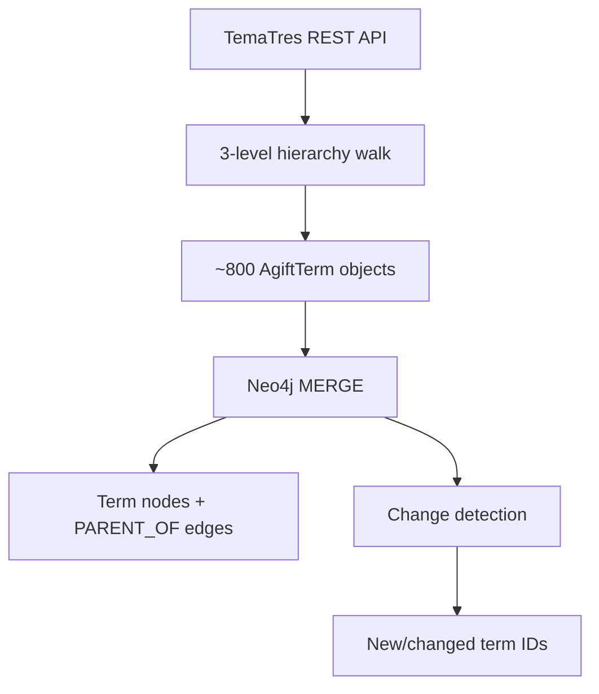
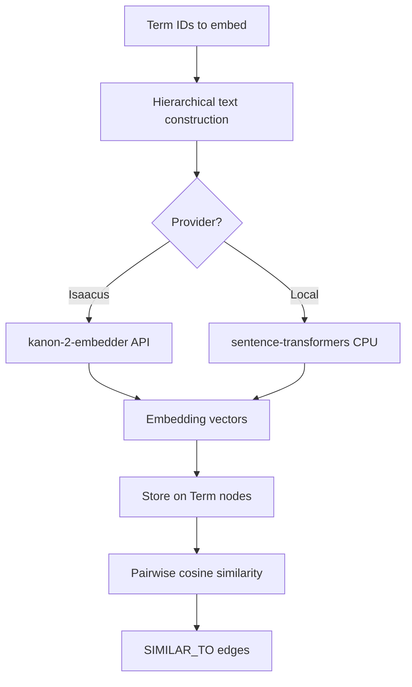
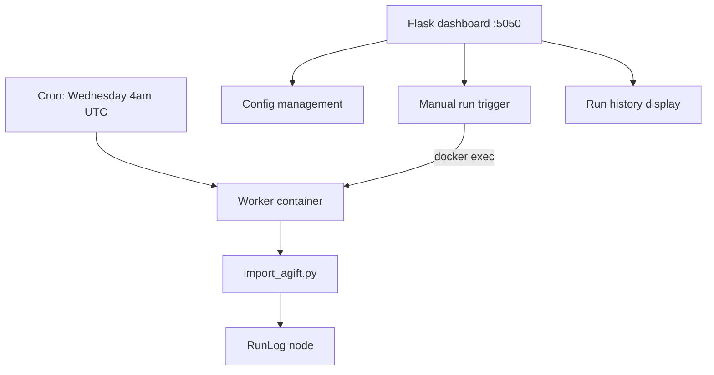

# Technical Methodology: AGIFT Graph Builder

## About

This is the technical methodology for the AGIFT Graph Builder, an open-source ETL pipeline that converts the Australian Government Interactive Functions Thesaurus (AGIFT) into a Neo4j knowledge graph with vector embeddings and semantic similarity edges.

AGIFT is maintained by the National Archives of Australia and describes ~800 government business functions across three hierarchical levels. The pipeline fetches this vocabulary, builds a structural graph, enriches it with embeddings, and creates semantic links between related functions.

## Pipeline steps

### 1. Vocabulary fetch

The pipeline walks the TemaTres REST API to retrieve the full AGIFT hierarchy. It performs a three-level depth traversal: top-level functions (L1), secondary functions (L2), and detailed functions (L3). Alternative labels for each term are fetched separately.

API endpoint: `https://vocabularyserver.com/agift/services.php`

| API task | Purpose | Example |
|----------|---------|---------|
| `fetchTopTerms` | Retrieve L1 functions | "Business support and regulation" |
| `fetchDown` | Walk children of a term | L1 → L2, L2 → L3 |
| `fetchAlt` | Get alternative labels | "hydrology monitoring" |

Retry logic: 3 attempts with exponential backoff (5s, 10s, 15s), 120s timeout. A 2-second sleep between L1 iterations for API politeness.

Input: TemaTres REST API | Output: ~800 `AgiftTerm` objects (term_id, label, parent_id, depth, dcat_theme, alt_labels)

### 2. Graph construction

Terms are upserted into Neo4j with a `MERGE` on `term_id`, ensuring idempotent writes. Terms are sorted by depth (L1 before L2 before L3) so parent nodes exist before child references are created.

Schema:
- Constraint: `term_id` unique on `:Term` nodes
- Indexes: `dcat_theme`, `depth`

Each term stores: `label`, `label_norm` (lowercase), `depth` (1-3), `dcat_theme` (DCAT-AP category code), `top_level_id`, and `alt_labels`.

Structural edges (`PARENT_OF`) link each term to its parent in the AGIFT hierarchy.

Change detection compares incoming labels and alt-labels against stored values. Only new or changed terms are flagged for re-embedding.

Output: ~800 `:Term` nodes, ~800 `:PARENT_OF` edges

### 3. DCAT-AP theme mapping

Each L1 function is mapped to a DCAT-AP theme code for interoperability with European open data standards. Child terms inherit their parent's theme.

| AGIFT function | DCAT-AP code | EU category |
|----------------|--------------|-------------|
| Business support and regulation | ENTR | Entrepreneurship |
| Health care | HEAL | Health |
| Environment | ENVI | Environment |
| Education and training | EDUC | Education |
| Transport | TRAN | Transport |
| Justice administration | JUST | Justice |

23 AGIFT top-level functions map to 17 DCAT-AP categories.

### 4. Hierarchical text construction

Before embedding, each term's label is expanded into a richer text representation that includes its hierarchical path and alternative labels.

Format: `"Level1 > Level2 > Level3 (also known as: Alt1, Alt2)"`

Example: `"Environment > Water resources management > Water quality monitoring (also known as: hydrology monitoring)"`

This path-based representation provides semantic context that a standalone label would lack — "Water quality monitoring" alone is less informative than the full chain from "Environment" through "Water resources management".

### 5. Embedding generation

Two embedding providers are supported:

| Provider | Model | Dimensions | Cost | Speed |
|----------|-------|------------|------|-------|
| Isaacus | kanon-2-embedder | 256, 384, 512, 768, 1024, 1792 | Paid API | ~1-2s per batch of 50 |
| Local | all-MiniLM-L6-v2 | 384 | Free | ~100-200ms per batch of 64 |
| Local | all-mpnet-base-v2 | 768 | Free | ~100-200ms per batch of 64 |

The local provider uses sentence-transformers models running on CPU. Models are downloaded from Hugging Face on first run and cached in a Docker volume.

Each term's hierarchical text (from step 4) is embedded into a dense vector. The resulting embedding is stored on the `:Term` node alongside metadata: `embedding_dimension`, `embedding_provider`, `embedded_at`.

Only new or changed terms are embedded unless `--force-embed` is used.

Output: ~800 embedding vectors stored on `:Term` nodes

### 6. Semantic similarity edges

Cosine similarity is computed between all pairs of embedded terms to discover semantic relationships that the structural hierarchy does not capture.

**Cosine similarity:**
```
similarity(a, b) = dot(a, b) / (||a|| * ||b||)
```

**Algorithm:**

1. Fetch all embedded terms from Neo4j
2. Group by embedding dimension (no cross-dimension comparisons)
3. Load structural edges to avoid duplicating hierarchy relationships
4. Compute pairwise cosine similarity for all term pairs within each dimension group
5. Filter: score >= threshold (default 0.70)
6. Skip pairs that already share a `PARENT_OF` edge
7. Create `SIMILAR_TO` edges with score, weight, and timestamp

All existing `SIMILAR_TO` edges are cleared before each rebuild — no incremental updates.

**Edge weighting (for query-time use):**

| Edge type | Weight | Purpose |
|-----------|--------|---------|
| `PARENT_OF` | 1.0 | Structural hierarchy (high priority) |
| `SIMILAR_TO` | 0.5 | Semantic similarity (lower priority) |

**Complexity:** O(n^2 * d) where n = terms per dimension group (~800), d = embedding dimension. For 800 terms at 512d: ~320,000 pairwise comparisons.

Default threshold: 0.70 | Configurable via CLI (`--threshold`) or dashboard

Output: SIMILAR_TO edges (count varies with threshold; typical range 10K-50K for ~800 terms at 0.70)

## Neo4j schema

### Nodes

**`:Term`** — AGIFT vocabulary terms

| Property | Type | Description |
|----------|------|-------------|
| term_id | int (unique) | TemaTres identifier |
| label | string | Term name |
| label_norm | string | Lowercase label |
| depth | int (1-3) | Hierarchy level |
| dcat_theme | string | DCAT-AP category code |
| top_level_id | int | Root L1 ancestor |
| alt_labels | list[string] | Alternative labels |
| embedding | list[float] | Vector embedding |
| embedding_dimension | int | Vector dimensionality |
| embedding_provider | string | "isaacus" or "local" |
| embedded_at | datetime | Embedding timestamp |

**`:Config`** — Pipeline configuration (single node)

| Property | Type | Description |
|----------|------|-------------|
| name | string | "agift" |
| isaacus_api_key | string | Isaacus API key |
| embedding_dimension | int | Active dimension |
| embedding_provider | string | Active provider |
| similarity_threshold | float | Min cosine similarity |
| semantic_edge_weight | float | SIMILAR_TO weight |

**`:RunLog`** — Pipeline execution history (last 20 retained)

| Property | Type | Description |
|----------|------|-------------|
| worker | string | "agift" |
| status | string | "success" or "error" |
| started_at / finished_at | datetime | Run duration |
| terms_fetched | int | Total from API |
| terms_created | int | New nodes |
| terms_updated | int | Changed nodes |
| terms_embedded | int | Successful embeddings |
| semantic_edges_created | int | SIMILAR_TO count |

### Edges

| Relationship | Direction | Properties | Description |
|-------------|-----------|------------|-------------|
| `PARENT_OF` | L1 → L2, L2 → L3 | — | Structural hierarchy |
| `SIMILAR_TO` | Term → Term | score, weight, edge_type, created_at | Semantic similarity |

## Data flow

### Stage 1 — fetch and build



### Stage 2 — embed and link



### Stage 3 — scheduling and monitoring



## Infrastructure

### Docker services

| Service | Port | Image | Purpose |
|---------|------|-------|---------|
| Neo4j | 7474, 7687 | neo4j:5 | Graph database |
| Dashboard | 5050 | python:3.13-slim + Flask | Web UI for config and run control |
| Worker | — | python:3.13-slim + cron | Pipeline execution and scheduling |

### Scheduled execution

The worker container runs a cron job: `0 4 * * 3` — every Wednesday at 4:00 AM UTC. This performs a full pipeline refresh (fetch, graph, embed, link).

Manual runs are triggered from the dashboard via `docker exec` into the worker container.

### Run presets (dashboard)

| Preset | CLI flags | Description |
|--------|-----------|-------------|
| Full Pipeline | (none) | Fetch + graph + embed + link |
| Graph Only | `--skip-embed --skip-semantic` | Structure only, no vectors |
| Local 384d | `--provider local --dimension 384` | Free embeddings, faster |
| Local 768d | `--provider local --dimension 768` | Free embeddings, higher quality |
| Dry Run | `--dry-run` | API fetch only, no writes |
| Force Embed | `--force-embed` | Re-embed all terms |

## Tools

| Tool | Purpose |
|------|---------|
| [TemaTres](https://vocabularyserver.com/agift/) | AGIFT vocabulary source (REST API) |
| [Neo4j](https://neo4j.com/) | Graph database (nodes, edges, Cypher queries) |
| [Isaacus](https://isaacus.com/) kanon-2-embedder | Cloud embedding API (256-1792d) |
| [sentence-transformers](https://www.sbert.net/) | Local CPU embeddings (384d, 768d) |
| [Flask](https://flask.palletsprojects.com/) | Dashboard web framework |
| Docker + cron | Containerised deployment and scheduling |

## Limitations

**Vocabulary scope.** AGIFT covers ~800 government functions. The pairwise similarity computation is O(n^2), which is tractable at this scale but would need optimisation (e.g., approximate nearest neighbours) for significantly larger vocabularies.

**Threshold sensitivity.** The 0.70 default cosine similarity threshold is a judgment call. Lower thresholds produce more edges (potentially noisy); higher thresholds produce fewer (potentially missing valid connections). The optimal threshold depends on the embedding model and downstream use case.

**No incremental semantic edges.** All `SIMILAR_TO` edges are deleted and rebuilt each run. For larger graphs, incremental updates would be more efficient.

**Cross-dimension incompatibility.** Terms embedded at different dimensions cannot be compared. Changing the embedding dimension requires re-embedding all terms.

**Local model quality.** The free sentence-transformers models (`all-MiniLM-L6-v2`, `all-mpnet-base-v2`) are general-purpose English models. They are not fine-tuned for government vocabulary. The Isaacus kanon-2-embedder may produce better results for this domain but requires a paid API key.

**Single-threaded similarity.** Cosine similarity is computed in a Python loop. For larger vocabularies, vectorised numpy operations or a compiled extension would improve performance.

**Source vocabulary accuracy.** AGIFT is maintained by the National Archives of Australia. The pipeline reflects whatever the TemaTres API returns, including any errors in the source data.

---

*Last updated: March 2026*
